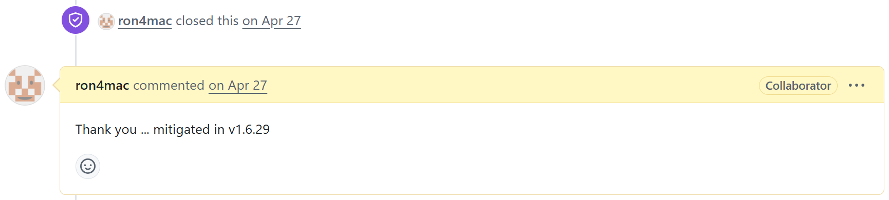
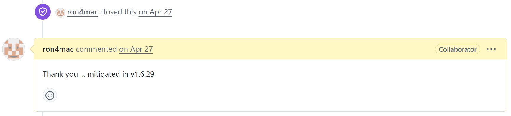
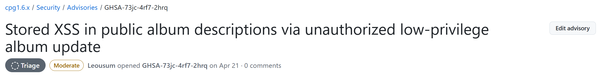
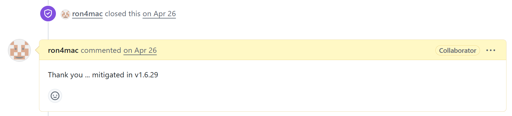

# Vendor Disclosure Process

These vulnerabilities in cpg1.6.x were reported through the official security advisory process. The vendor has already fixed the issues.

The screenshot below shows part of the advisory-based disclosure record. To protect personal privacy, all reporter-related sensitive information in the image has been redacted before publication.

(1) https://github.com/coppermine-gallery/cpg1.6.x/security/advisories/GHSA-3ph4-fc33-4wg6

(2) https://github.com/coppermine-gallery/cpg1.6.x/security/advisories/GHSA-97v5-jcgp-9r94

(3) https://github.com/coppermine-gallery/cpg1.6.x/security/advisories/GHSA-73jc-4rf7-2hrq

(4) https://github.com/coppermine-gallery/cpg1.6.x/security/advisories/GHSA-qr3w-g3cp-2c6v

(5) https://github.com/coppermine-gallery/cpg1.6.x/security/advisories/GHSA-w5cx-57f8-2cpw

