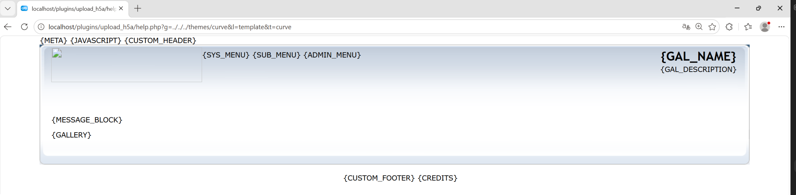

# Unauthenticated path traversal in upload_h5a help endpoint allows local .html file read

### Summary

`plugins/upload_h5a/help.php` allows unauthenticated path traversal via the `g` and `l` parameters, which can be used to read local `.html` files.

### Details

In `plugins/upload_h5a/help.php` (around lines 14-26), user-controlled `g` and `l` are concatenated into a local path and passed to `readfile()`. The code uses `htmlentities()`, but that does not block `../`, so directory traversal is still possible.

### PoC

Request:
`http://localhost/plugins/upload_h5a/help.php?g=../../../themes/curve&l=template&t=curve`

Result:
HTTP 200, with the contents of `themes/curve/template.html` returned in the response.

Tested on Coppermine Photo Gallery 1.6.28 with the `upload_h5a` plugin enabled. No authentication is required. The target file must end with `.html`.

### Impact

Any unauthenticated user can read arbitrary local `.html` files reachable from this path, causing information disclosure.