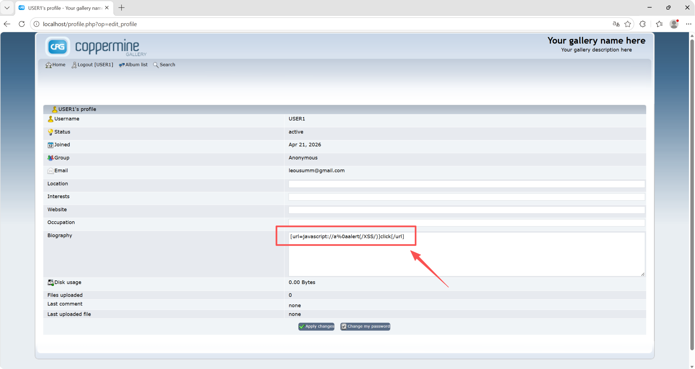
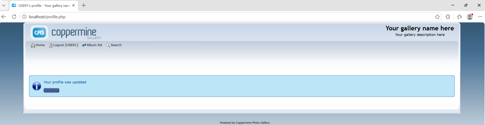
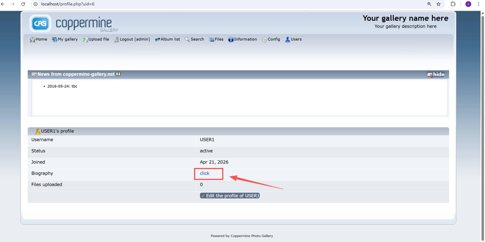
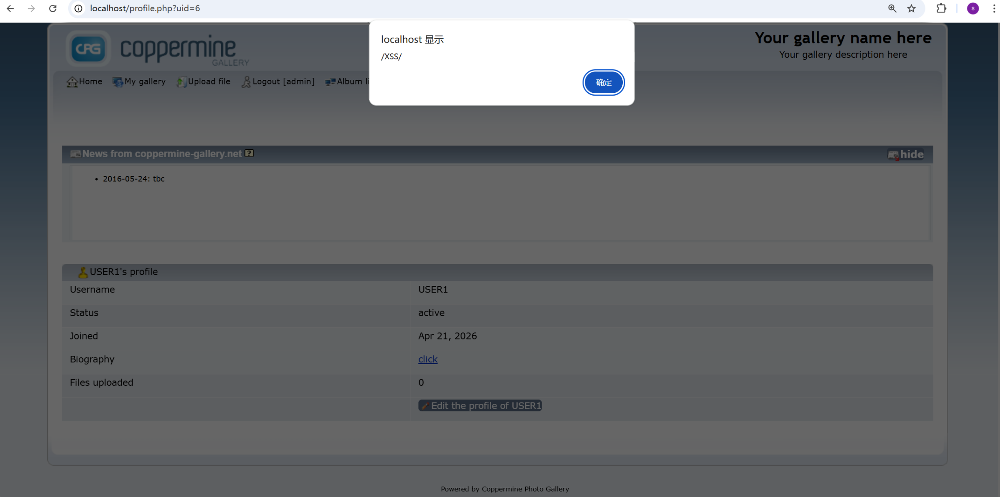

# Stored XSS in public user profile biography via unsafe BBCode URL scheme handling

A normal registered user can store a malicious BBCode URL in their public profile biography. The profile page renders the value through `bb_decode()` without restricting dangerous URI schemes, resulting in stored, click-triggered XSS visible to anonymous visitors and other users.

### Details

In `profile.php` around line 373, `user_profile6` is read from the profile update form. Around line 391, it is stored in the users table. Around line 789, the public profile page renders `user_profile6` through `bb_decode()`.

In `include/functions.inc.php` around line 684, `bb_decode()` parses BBCode. Around line 744, the `[url=scheme://...]` pattern accepts arbitrary schemes and does not enforce an allowlist such as `http` or `https`.

As a result, a user can save a biography value such as:
`[url=javascript://a%0aalert(/XSS/)]click[/url]`

The public profile page then renders it as a clickable `javascript:` link.

### PoC

Verified on Coppermine Photo Gallery 1.6.28.

No special encoding is required for this PoC.

Steps:

1. Log in as a normal registered user.

2. Open the profile edit page:
   `http://localhost/profile.php?op=edit_profile`

3. Set the `Biography` field to:
   `[url=javascript://a%0aalert(/XSS/)]click[/url]`

   

4. Save the profile.

   

5. Log out, or use another browser/session.

6. Visit the public profile page:
   `http://localhost/profile.php?uid=<USER_ID>`

   

7. The page renders a link labeled `click`.

8. Inspecting the link shows a dangerous JavaScript URI, for example:
   `href="javascript://a%0aalert(/XSS/)"`

9. Clicking the link executes JavaScript in the application origin.

   

Example public profile URL:
`http://localhost/profile.php?uid=6`

### Impact

Any normal registered user can store a malicious link in their public profile. Anonymous visitors and authenticated users who view the profile and click the rendered link will execute attacker-controlled JavaScript in the context of the Coppermine application.

