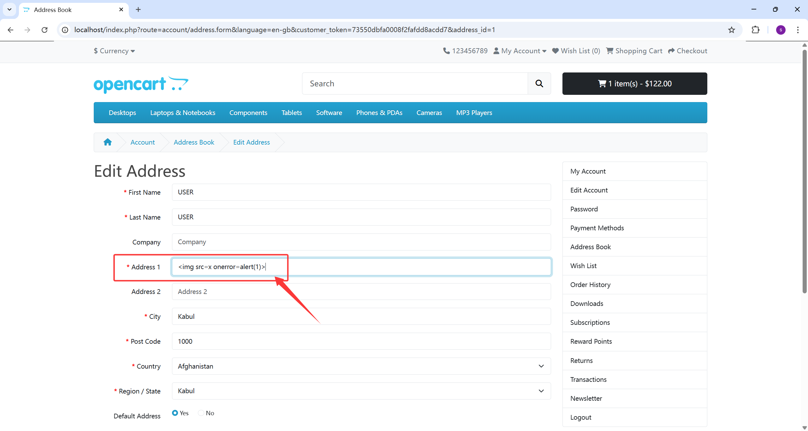
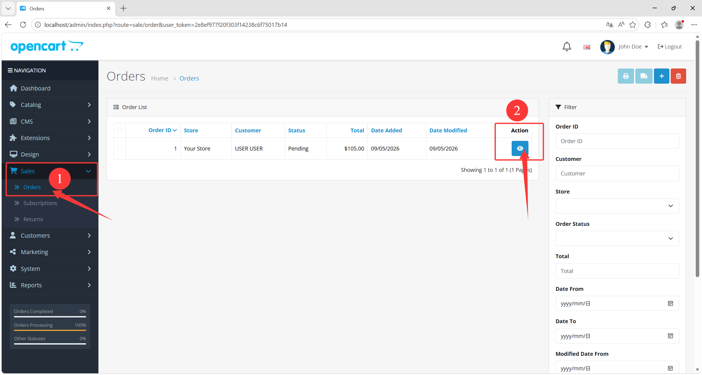
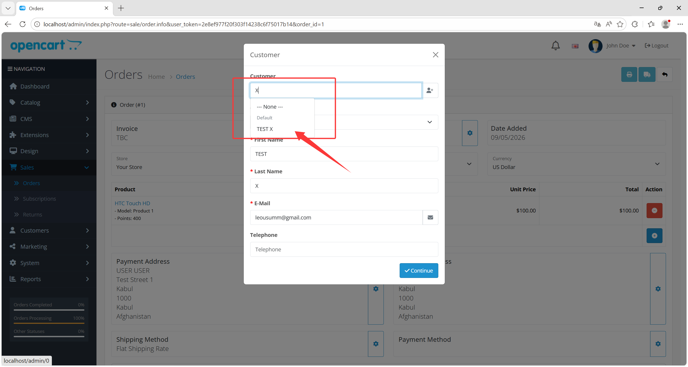
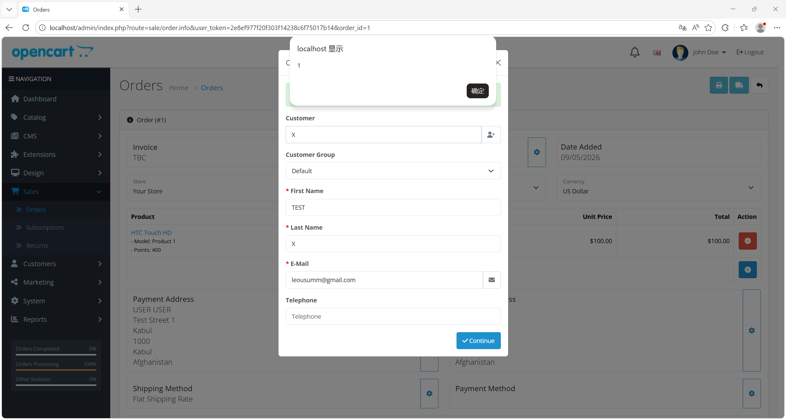

# Stored XSS via Customer Address in Admin Order Workflow

### Summary

A stored cross-site scripting issue exists in OpenCart 4.1.0.3 and can be triggered by a **normal front-office user**. This does **not** require administrator privileges.

A regular customer can place attacker-controlled HTML into address fields such as `address_1`. The backend customer autocomplete API later returns this stored value, and the admin order workflow decodes it and injects it into a `<select>` using raw HTML concatenation.

- **Affected Version**: `OpenCart 4.1.0.3` confirmed
- **Attack Prerequisite**:
  - a normal front-office customer account
  - administrator opens an affected backend order workflow and selects the attacker-controlled customer

### Detail

The vulnerable data flow is:

- [catalog/controller/account/address.php:309](/D:/develop/Apache24/htdocs/opencart_4.1.0.3/upload/catalog/controller/account/address.php:309)
  - normal customer address save entry
- [catalog/controller/account/address.php:397](/D:/develop/Apache24/htdocs/opencart_4.1.0.3/upload/catalog/controller/account/address.php:397)
  - attacker-controlled address data is persisted
- [catalog/model/account/address.php:41](/D:/develop/Apache24/htdocs/opencart_4.1.0.3/upload/catalog/model/account/address.php:41)
  - values are written into `oc_address`
- [admin/controller/customer/customer.php:1518](/D:/develop/Apache24/htdocs/opencart_4.1.0.3/upload/admin/controller/customer/customer.php:1518)
  - backend autocomplete returns stored address records
- [admin/view/template/sale/order_info.twig:1159](/D:/develop/Apache24/htdocs/opencart_4.1.0.3/upload/admin/view/template/sale/order_info.twig:1159)
  - address fields are passed through `decodeHTMLEntities(...)` and concatenated into an `<option>` string
- [admin/view/template/sale/order_info.twig:1162](/D:/develop/Apache24/htdocs/opencart_4.1.0.3/upload/admin/view/template/sale/order_info.twig:1162)
  - the final HTML is written with `$('#input-payment-address').html(html)` and `$('#input-shipping-address').html(html)`
- [admin/view/javascript/common.js:443](/D:/develop/Apache24/htdocs/opencart_4.1.0.3/upload/admin/view/javascript/common.js:443)
  - shared backend autocomplete implementation also uses `$dropdown.html(html)`

This allows a stored payload to break out of the generated `<option>` context and become active HTML/JavaScript in the administrator page.

### Reproduction Steps

1. Log in as a normal customer.

2. Add or edit a saved address and set `address_1` to:

   ```html
   
   ```

   URL：http://localhost/index.php?route=account/address.form&language=en-gb&customer_token=<token>&address_id=1

   

3. Log in to the admin panel.

4. Open the order creation/edit page:

   [http://localhost/admin/index.php?route=sale/order.info&user_token=<valid_token>](http://localhost/admin/)

   

5. Open the customer selection dialog, search for the attacker customer, and select it.

   

6. Observe that the backend autocomplete response returns the address in encoded form:

   ```json
   "address_1":"&lt;img src=x onerror=alert(1)&gt;"
   ```

   

7. The frontend decodes and concatenates that value into the address `<select>`. The resulting HTML becomes:

   ```html
   <option value="0">None</option><option value="1">USER USER, , Kabul, Afghanistan</option>
   ```

8. The injected script executes in the administrator browser.

### PoC

Front-office address payload:

```html

```

Representative vulnerable backend rendering:

```html
<option value="0">None</option><option value="1">USER USER, , Kabul, Afghanistan</option>
```

### Impact

This issue allows a normal customer to store attacker-controlled HTML in address data and later execute JavaScript in an administrator browser from backend order management.

Practical impact includes:

- stored XSS in the admin panel
- administrator session theft
- arbitrary admin-side action execution
- compromise of order handling and customer management flows
