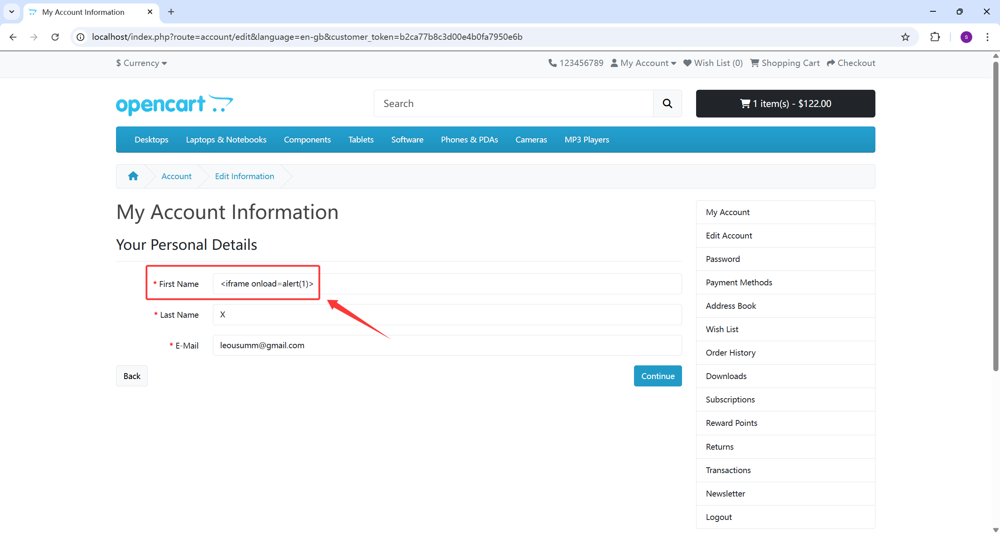
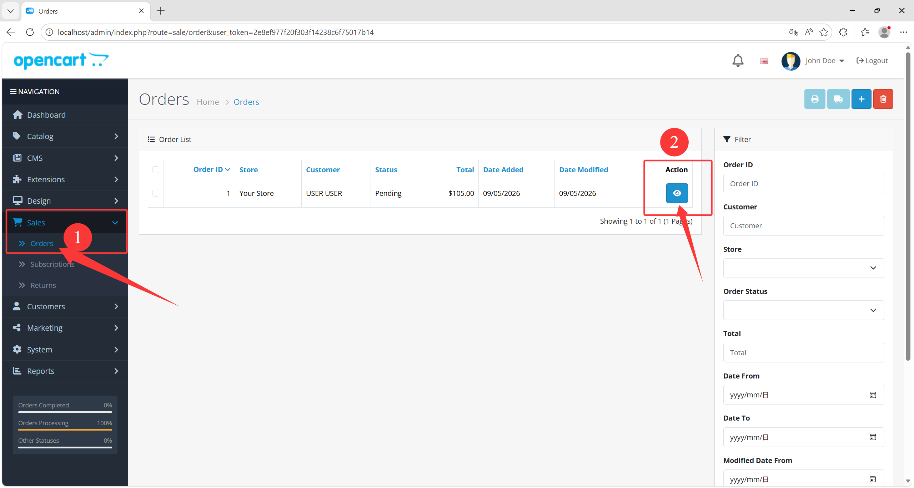
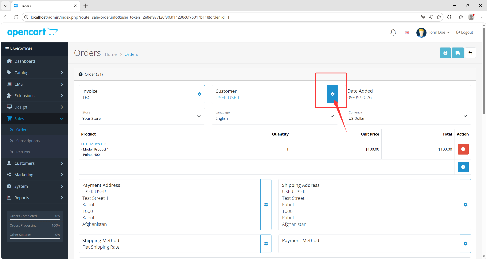
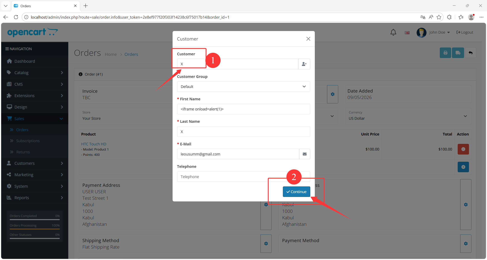
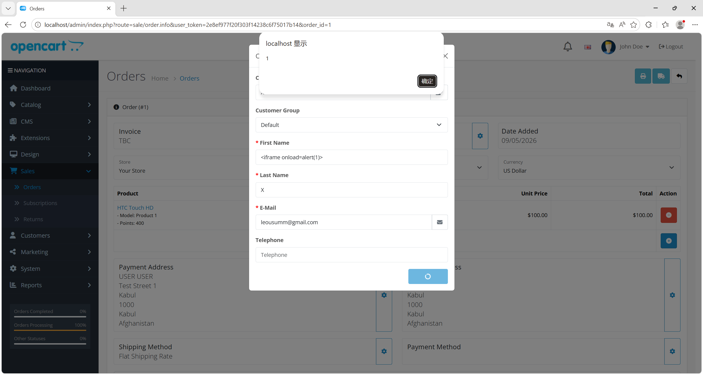

# Stored XSS via Customer Name in Admin Order / Return Workflows

### Summary

A stored cross-site scripting issue exists in OpenCart 4.1.0.3 and can be triggered by a **normal front-office user**. This does **not** require administrator privileges.

A regular customer can place attacker-controlled HTML into their account profile fields such as `firstname`. That value is later returned by the admin customer autocomplete API and then injected into backend HTML through JavaScript without safe encoding.

- **Affected Version**: `OpenCart 4.1.0.3` confirmed
- **Attack Prerequisite**:
  - a normal front-office customer account
  - administrator opens an affected backend workflow and selects the attacker-controlled customer

### Detail

The vulnerable data flow is:

- [catalog/controller/account/edit.php:98](/D:/develop/Apache24/htdocs/opencart_4.1.0.3/upload/catalog/controller/account/edit.php:98)
  - normal customer profile update entry
- [catalog/controller/account/edit.php:160](/D:/develop/Apache24/htdocs/opencart_4.1.0.3/upload/catalog/controller/account/edit.php:160)
  - attacker-controlled `firstname` / `lastname` is persisted
- [catalog/model/account/customer.php:90](/D:/develop/Apache24/htdocs/opencart_4.1.0.3/upload/catalog/model/account/customer.php:90)
  - values are written into `oc_customer`
- [admin/controller/customer/customer.php:1488](/D:/develop/Apache24/htdocs/opencart_4.1.0.3/upload/admin/controller/customer/customer.php:1488)
  - backend customer autocomplete endpoint
- [admin/controller/customer/customer.php:1517](/D:/develop/Apache24/htdocs/opencart_4.1.0.3/upload/admin/controller/customer/customer.php:1517)
  - `name` is passed through `html_entity_decode(..., ENT_QUOTES, ...)`
- [admin/view/javascript/common.js:422](/D:/develop/Apache24/htdocs/opencart_4.1.0.3/upload/admin/view/javascript/common.js:422)
  - autocomplete results are rendered into HTML with string concatenation and `$dropdown.html(html)`
- [admin/view/template/sale/order_info.twig:1139](/D:/develop/Apache24/htdocs/opencart_4.1.0.3/upload/admin/view/template/sale/order_info.twig:1139)
  - selected customer fields are passed through `decodeHTMLEntities(item['firstname'])`
- [admin/view/template/sale/order_info.twig:1231](/D:/develop/Apache24/htdocs/opencart_4.1.0.3/upload/admin/view/template/sale/order_info.twig:1231)
  - the decoded name is written into `#output-customer` via `.html(...)`
- [admin/view/template/sale/returns_form.twig:359](/D:/develop/Apache24/htdocs/opencart_4.1.0.3/upload/admin/view/template/sale/returns_form.twig:359)
  - same pattern exists in the return management workflow

The core issue is that backend JavaScript decodes entity-encoded values and then injects them into HTML using `.html(...)` or raw string concatenation.

### Reproduction Steps

1. Log in as a normal customer.

2. Update the customer profile and set:

   ```html
   <iframe onload=alert(1)>
   ```

   as the `firstname`.

   

3. Log in to the admin panel.

4. Open the order creation/edit page:

   [http://localhost/admin/index.php?route=sale/order.info&user_token=<valid_token>](http://localhost/admin/)

   

5. In the customer selection dialog, search for the attacker account and select it.

   

   

6. Observe that the backend autocomplete response contains the customer value in encoded form:

   ```json
   "firstname":"&lt;iframe onload=alert(1)&gt;"
   ```

   

7. The frontend then decodes and injects it into HTML. The resulting DOM fragment becomes:

   ```html
   <a href="index.php?route=customer/customer.form&user_token=...&customer_id=1" target="_blank"><iframe onload=alert(1)> X</a>
   ```

8. The payload executes in the administrator browser.

### PoC

Front-office profile update payload:

```html
<iframe onload=alert(1)>
```

Representative backend rendering after customer selection:

```html
<a href="index.php?route=customer/customer.form&user_token=...&customer_id=1" target="_blank"><iframe onload=alert(1)> X</a>
```

### Impact

This issue allows a normal customer to store attacker-controlled HTML in customer profile data and later execute JavaScript in an administrator browser from backend order or return workflows.

Practical impact includes:

- stored XSS in the admin panel
- administrator session theft
- arbitrary admin-side action execution via browser context
- compromise of order and customer management workflows
