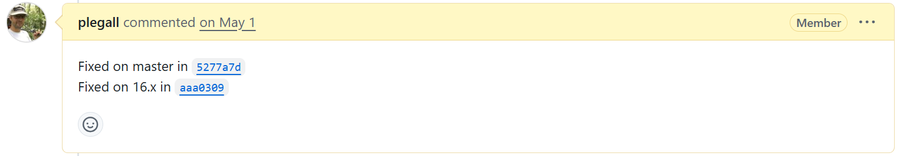

# Vendor Disclosure Process

These vulnerabilities in Piwigo were reported through the official security advisory process. The vendor has already fixed the issues.

The screenshot below shows part of the advisory-based disclosure record. To protect personal privacy, all reporter-related sensitive information in the image has been redacted before publication.

