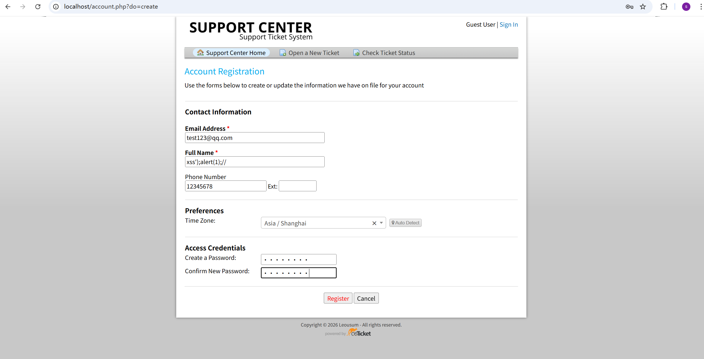
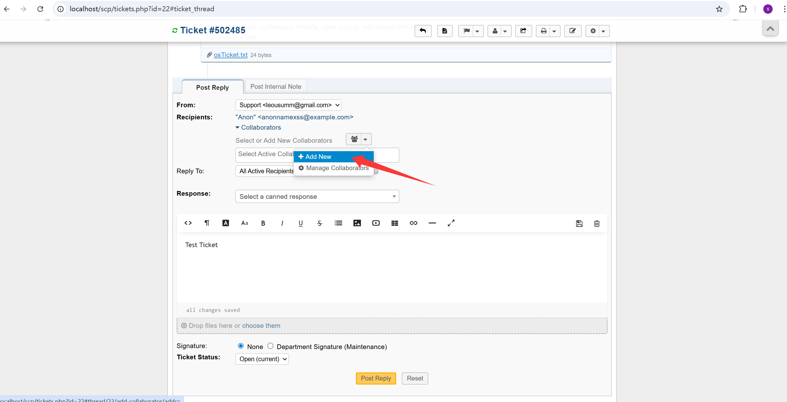
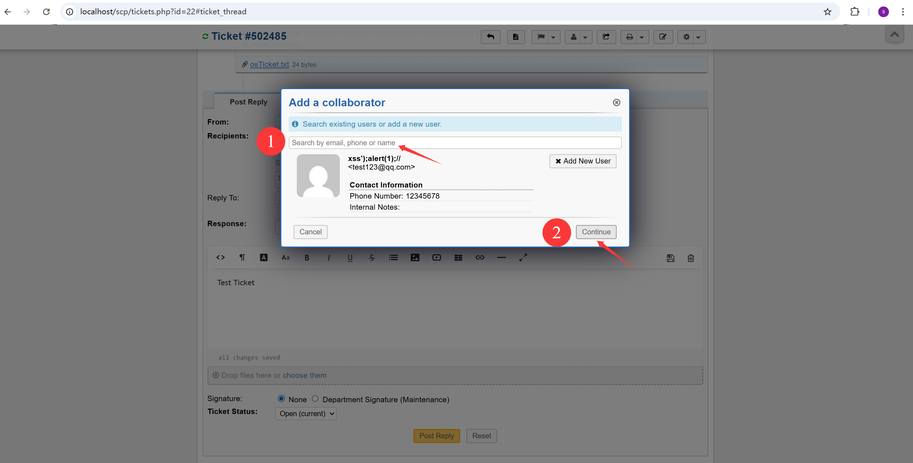
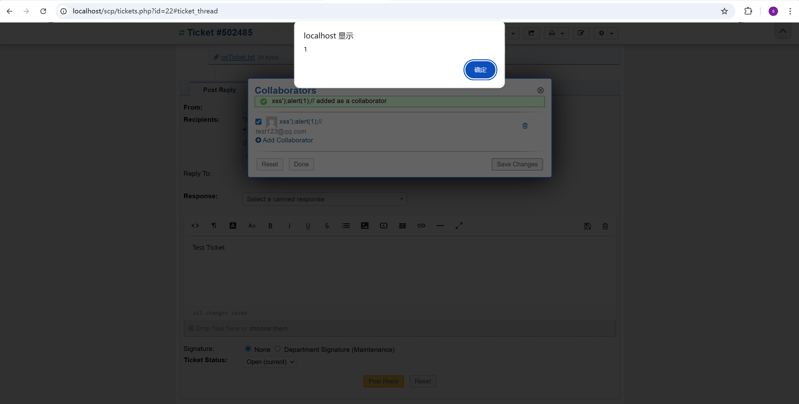

# 1.**Vulnerability Description**

A stored cross-site scripting (Stored XSS) vulnerability exists in the staff-side collaborator management workflow. A **regular user** can complete the attack by registering or being created with a crafted **malicious name**, and the payload is later triggered when an administrator or another staff user views or manages collaborators for a ticket in the staff panel.

The root cause is that user-controlled collaborator names are rendered into the collaborator management response without proper JavaScript-context encoding. The vulnerable output is generated in `include/staff/templates/collaborators.tmpl.php`, and the attack path is reachable through the collaborator-related AJAX handlers in `include/ajax.thread.php`. In addition, the staff panel CSP configuration in `include/staff/header.inc.php` permits inline script execution, which allows the injected payload to run in the administrator’s browser once the malicious collaborator is processed or displayed.

In practice, this means that no administrator privileges are required to plant the payload: a low-privileged normal user is sufficient to introduce the malicious data, while the actual code execution occurs in the higher-privileged staff or administrator context.

**Affected version**: v1.18.3. (Other versions have not been tested.)

# 2.**Reproduction Steps**

(1) Open the public ticket/user creation workflow and create a normal user with the following name:
```text
xss');alert(1);//
```

URL: http://localhost/account.php?do=create



(2) Log in to the staff panel with any staff account that **has access to the target ticket**. Open a ticket and add the previously created user as a collaborator.

URL: http://localhost/scp/tickets.php?id=22#ticket_thread



(3) When the collaborator list is refreshed, the AJAX response returns a script block that updates the collaborator dropdown.



Observe that the malicious collaborator name is inserted into a single-quoted JavaScript string without encoding, causing JavaScript execution in the staff browser.




# **3.PoC**

Malicious collaborator name:

```text
xss');alert(1);//
```

Resulting AJAX response snippet:

```js
$('#collabselection').html('<option value="4" selected="selected" class="active">xss');alert(1);//</option>');
```

This breaks out of the intended string and executes `alert(1)` in the staff panel.


# **4.Impact**

An attacker can store a malicious payload in a user-controlled name field and have it executed in the browser of a staff user when that user is added or rendered as a collaborator. This can lead to session hijacking, arbitrary actions in the staff context, unauthorized ticket access or modification, and further compromise of the helpdesk environment depending on the privileges of the affected staff account.